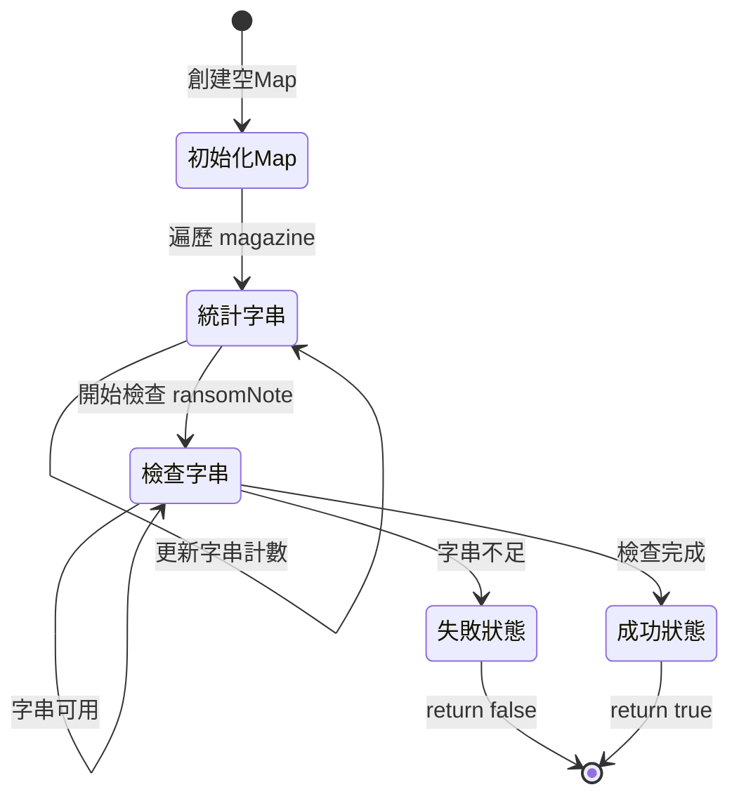

> [題目連結](https://leetcode.com/problems/ransom-note)
> 主題：Hash Table, String, Counting
> 難度：Easy

## 題目描述

給定兩個字串 `ransomNote` 和 `magazine`，判斷 `magazine` 中的字串是否可以用來組成 `ransomNote`。
`magazine` 中的每個字串只能在 `ransomNote` 中使用一次。

### 題目範例

```bash
輸入：ransomNote = "aa", magazine = "aab"
輸出：true
解釋：magazine 中有兩個 'a' 和一個 'b'，可以用來組成 "aa"
```

### 限制條件

- 1 <= ransomNote.length, magazine.length <= 105
- ransomNote 和 magazine 由小寫英文字母組成

## 解題思路

### 狀態機解析



#### 狀態說明

1. 初始化 Map
   - 新增空的 Map
   - 準備統計字串頻率

2. 統計字串
   - 遍歷 magazine 字串
   - 記錄每個字串出現次數

3. 檢查字串
   - 遍歷 ransomNote 字串
   - 檢查並扣減可用字串數

4. 結果狀態
   - 成功：所有字串都可用
   - 失敗：某個字串不足

### 複雜度分析

- 時間複雜度：O(m + n)
  - m 是 magazine 長度
  - n 是 ransomNote 長度
  - 需要遍歷兩個字串
- 空間複雜度：O(1)
  - 固定大小的字串集（26個字母）
  - 與輸入規模無關

## 程式碼實現

```typescript
function canConstruct(ransomNote: string, magazine: string): boolean {
  // 新增 Map 物件
  const charCount = new Map<string, number>();

  // 統計 magazine 中字串頻率
  for (const char of magazine) {
    charCount.set(char, (charCount.get(char) || 0) + 1);
  }

  // 檢查 ransomNote 中的每個字串
  for (const char of ransomNote) {
    const count = charCount.get(char) || 0;
    if (count === 0)
      return false;
    charCount.set(char, count - 1);
  }

  return true;
}
```

### 程式碼解釋

1. Map 初始化和字符統計
   - 使用 Map 存儲字符頻率
   - 使用 get/set 管理計數

2. 字串的檢查和更新
   - 檢查字串可用性
   - 更新剩餘數量
